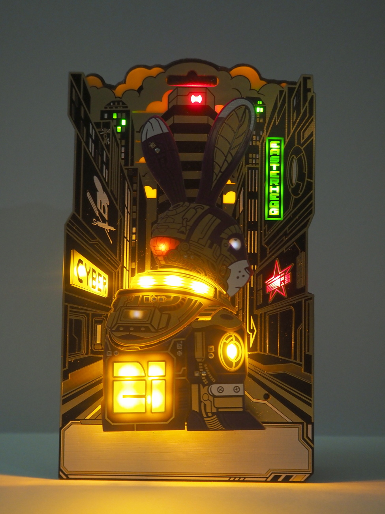
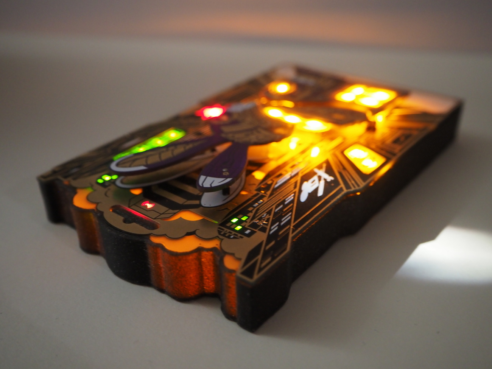
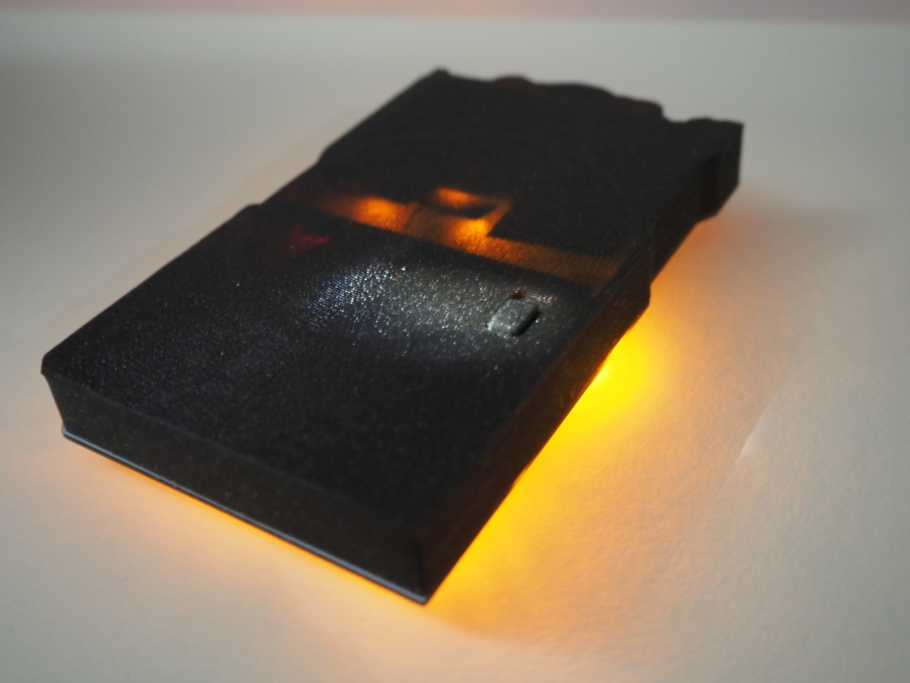
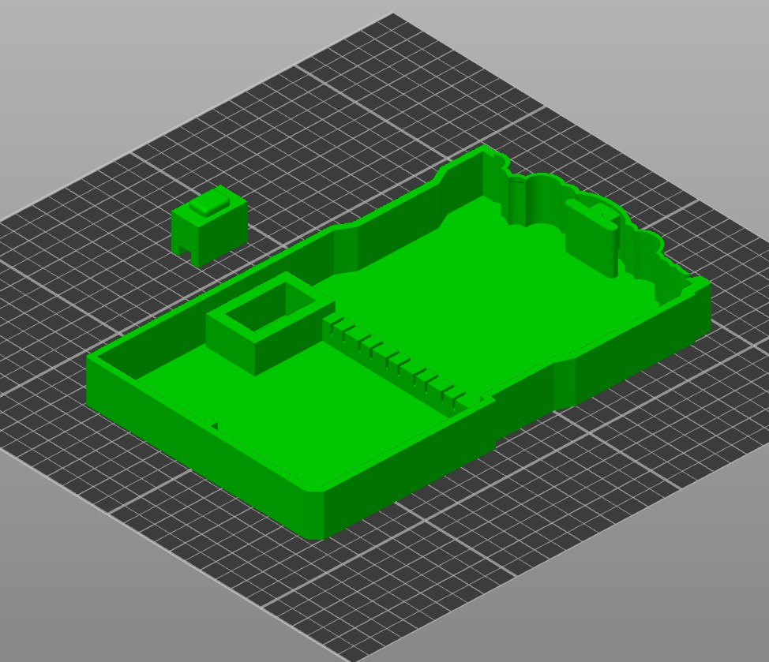
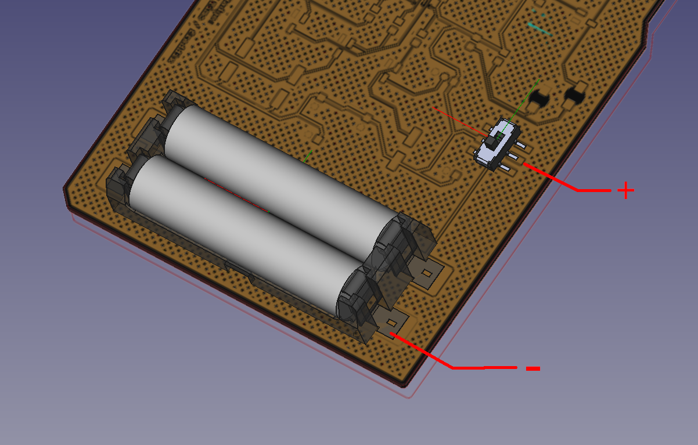
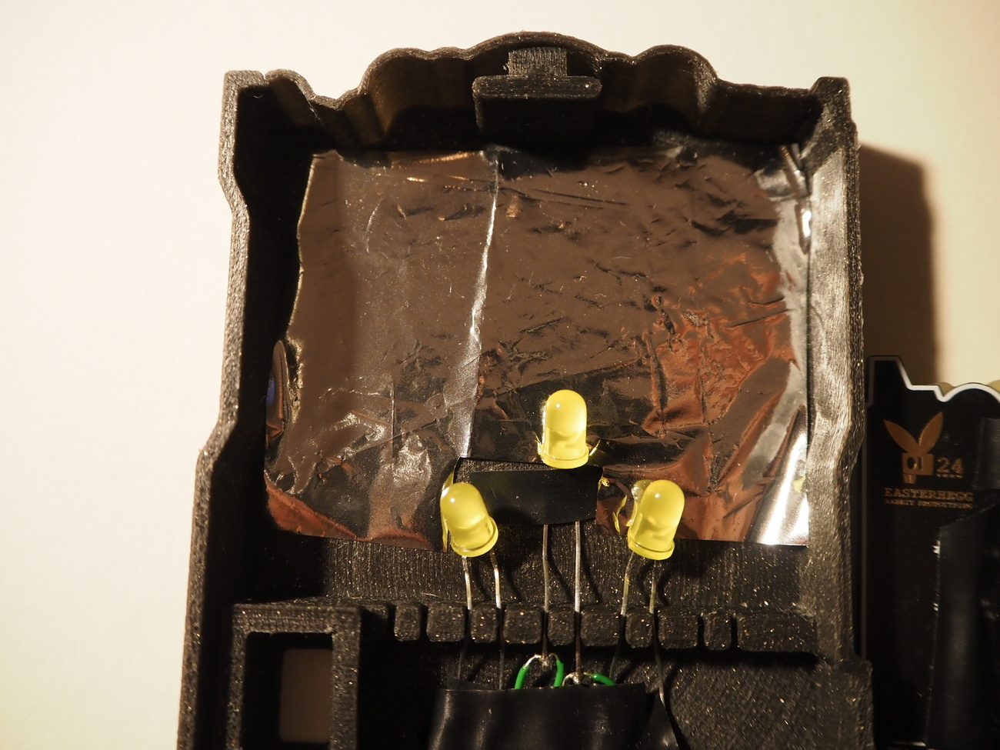

# Badge Cover

This is a cover for the back of the Badge. Optionally it can be equipped with additional LEDs to add an addition layer of illumination (translucent clouds in the background)

## Parts

* back_cover.stl
* switch_cap.stl

### print orientation

Support material should not be required

## Additonal illumination

switched power can be grabbed from these pins:

Additional LEDs can be mounted on the rail at the center of the cover like this:

Glueing a shred of space blanket to behind the leds will help to create a snooth cloud illumnation

LEDs on the PCB adjacent to the translucent clouds should be masked with tape. 

## Assembly
* Hold the badge face down and attach the switch cap to the switch
* Hook the stud on the bottom edge of the back cover into the nook of the battery holder
* When pressing the badge towards the cover they should snap together
