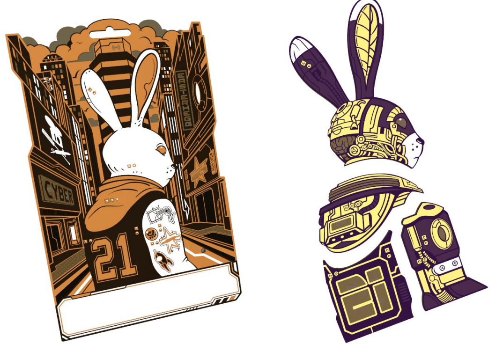

  

Das Easterhegg 2024 in der OTH Regensburg ist zu Ende. So auch das Rabbit Chaos Adventure.

## Badge

  

## Story

### 0.1: Hello, World!

Hacker h0pz sitzt in seinem Keller. Es ist kühl. Grelles Neonlicht beleuchtet den Raum. Durch die schwarzen Rohre an der Decke plätschert Wasser. Im Regal stehen viele Kisten mit bunten Kabeln. Die Lüfter an der Wand geben ein leises Summen von sich.

Der Bass aus den Boxen schüttelt h0pzs Fell. "Vielleicht doch wieder etwas zu doll ..", denkt h0pz und dreht den Regler am Mischpult runter. Er nimmt einen Schluck Karottensprudel aus seiner Flasche. Dann schaut er wieder auf seinen Laptop. "Execution failed!", zeigt sein Terminal.

"Snervt!", grummelt h0pz. Er steht auf, greift zu seiner Jacke und lässt die Tür hinter sich zu fallen.

**In welcher Stadt lebt Hacker h0pz?**

### 1.1: Karotteneintopf

Der Messenger klingelt. Oma Gretchen hat eine Sprachnachricht gesendet. Ihr Computer. Der macht ja schon wieder nur komische Sachen. Und alles ist langsam. Sie versteht das nicht. Aber Computer überhaupt, die versteht sie ja auch nicht mehr so. Normalerweise ist h0pz etwas genervt von solchen Fragen. Aber Oma Gretchen ist die Beste! Und ihr Karotteneintopf ist traumhaft. h0pz  macht sich auf den Weg. 

"Zeig mal her.", sagt h0pz. Er schaut auf ihren Computer. Eine laute röhrende Kiste unter dem Tisch. Und nur 65536 Kerne.

h0pz schaut in die Prozessliste und sieht schnell: Hier ist Software am Werk die hier nicht hingehört. Er schaut durch Logfiles. Ihm fällt ein String auf.

> TG9sLCB3ZSBhcmUgQmxhY2tCeXRlIEhheG9ycy4gbjAwYiEK

**Was hat es mit dem String auf sich?**

### 1.2: Fileserver

h0pz beobachtet die Software weiter. Sie baut verschiedene Verbindungen auf. Ob das der Command-and-Control-Server ist? "Wer hier der n00b ist, muss sich erstmal zeigen ..", denkt h0pz. Der Traffic ist 9000bit-verschlüsselt. Hier ist nichts zu machen. Er wirft einen Portscanner an. Port 32090 ist offen. Er findet einen Fileserver. "Was für Anfänger!", denkt er.

> - passwd
>
> - vid23.mp4
>
> - Charlie-Chaplin.mp4

**Finde das Secret!**

### 1.3: White Hats

Er löscht die Software von Oma Gretchens Computer. Dann löscht h0pz alle Daten auf dem Server und schaltet ihn ab. Aber wer ist BlackByte?

h0ps weiß, alleine kann er das nicht schaffen. Er braucht Verstärkung. Und zwar viel. Er hatte vor kurze einen Aufruf einer White Hat-Gruppe gesehen:

> We've been organizing in secret - something tells us that we are being watched. If you want to, you can join us. But you will have to find us. If you talk to the other animals, they can tell you where to go. You’ll have to enter our supporting webpage, www.ratisbona-coding.org and combine this URL with the secret code. Find them and learn about the code - you'll have to enter this webpage with the code.

**Schließe dich der Gruppe an um gegen BlackByte zu kämpfen!**

### 2.1: Urban Art

h0pz hält sein Badge in der Hand. Es blinkt fröhlich vor sich hin. Er hat es selbst gebaut. Das Badge erstellt zufällig Snaphots der Umgebung und zeigt sie an.

h0pz bewundert den Snapshot und findet eine Menge Graffiti in der Stadt.

**Welches findest du auf dem Badge?**

### 2.3: Resistance

Das Badge hört auf zu blinken. Dabei sind die Batterien nicht leer. Vielleicht ist es kaputt gegangen.

h0pz muss sich das genauer ansehen.

**Wie groß ist der Widerstand 20?**

### 2.4: Sparkle

Es funktioniert noch immer nicht. Der falsche Widerstand ist nicht die Ursache.

Er muss sich weiter mit dem Problem beschäftigen.

**In welcher Farbe leuchtet LED 9?**

### 2.5: Circuit

h0pz konnte den Fehler endlich finden. Ein wenig Lötzinn später funktioniert das Badge auch schon wieder.

Er hat beim Aufbau einen sehr einfachen IC verwendet. In einer Welt voller hochentwickelter Technologien sind die simplen Dinge viel cooler.

**Wie viele Ausgänge hat der verwendete Chip?**

### 2.6: What the clock?

Er betrachtet sein Badge. "Schön ist es geworden!", freut sich h0pz.

Sogar den Blinkinterval hat er genau abgestimmt.

**In welcher Frequenz schaltet der Ausgang 2 (Hz, gerundet auf zwei Nachkommastellen)?**

### 3.1: Memory G4

h0ps streift umher. Er liebt die Stadt und die Lebewesen hier.

**Finde einen Sticker G4!**

### 3.2: Memory M8

h0ps streift umher. Er liebt die Stadt und die Lebewesen hier.

**Finde einen Sticker M8!**

### 3.3: Enigmatassen

h0pz sitzt in der Sternenbar. Coole Tassen gibt es hier. Wenn man mehrere davon nimmt, kann man eine Enigma bauen. An der Wand hängt eine Anleitung.

**Entschlüssele das Geheimnis 'IGUKJ' in der Enigma mit zwei Tassen und dem Schlüssel oMg**

### 3.4: Long time ago

h0pz unterhält sich mit dem Barkeeper Mo. "hpx war lange nicht mehr hier.", sagt Mo. "Und das obwohl er direkt hier um die Ecke am Suburb Park wohnt." "Das passt gar nicht zu ihm", sagt h0pz. Er versucht ihn zu erreichen.

**Wo ist hpx?**

### 3.5: Another World

Das hat wohl nicht geklappt. Kein Wunder, lacht Mo. "Der lebt einfach in einer anderen Welt. Antwortet nie auf dem Messenger. Dafür hat er noch ein Fax. Vermutlich läuft sein Briefkasten einfach über."

**Finde heraus ob es hpx gut geht!**

### 4.1: Blue Pillars

Ein lauer Frühlingsabend. h0pz möchte Kiki treffen. Sie wollen zusammen auf das Dach des alten Hightower unten an der Water Lane klettern. h0pz hat seine Picktools und einen Bolzenschneider im Rucksack. Der Zugang zum Dach ist gut gesichert, aber die Aussicht muss sehr gut sein. Es wird sich lohnen.

Sie treffen sich immer an den blauen Säulen um von dort loszuziehen.

**Welchen Winkel haben die blauen Säulen vor einem der Gebäude?**

### 4.2: Memory F3

Kiki taucht nicht auf. Wo könnte sie stecken?

h0pz schaut sich genauer um. 

**Finde den Sticker F3!**

### 4.3: Memory X9

Das ist komisch. h0pz sucht weiter. 

Er schaut sich weiter um.

**Finde einen weiteren Sticker X9!**

### 4.4: Strawberrycake

Kiki ist noch immer nicht zu sehen. Irgendwie ist das merkwürdig. h0pz möchte sie suchen. Er läuft durch die Gegend.

Er kommt vorbei am Salad Pot. Einem beliebten Gemüserestaurant. Er bleibt stehen und dreht sich um. Dort hinten das Hung Rice, heute geschlossen. Hier Salad Pot, gut besucht. Dazwischen die Cake Kitchen, dort gibt es den leckersten Strawberrycake der Stadt. 

**Wie viele Cafeten gibt es an Uni und OTH?**

### 4.5: Locked Door

Da ist Kiki! Sie sitzt in der Cake Kitchen. "Sorry, h0pz!", sagt sie. "Ich habe den Kuchen gesehen und konnte einfach nicht daran vorbei laufen. Aber lass uns jetzt endlich losziehen!" 

Sie laufen durch die Straßen zur Water Lane.  Am Hightower angekommen, finden sie eine kleine unverschlossene Tür. Dahinter befindet sich ein großer leerer Raum. Die Betonwände haben Risse bekommen. Es gibt eine schmale Treppe an der Seite. Oben angekommen bleiben sie vor einer schweren Eisentür stehen. Auf dem digitalen Schloss steht:

> 490018 / 120955 / ?

Was soll das bedeuten? Beide denken nach.

**Finde die Lösung!**
